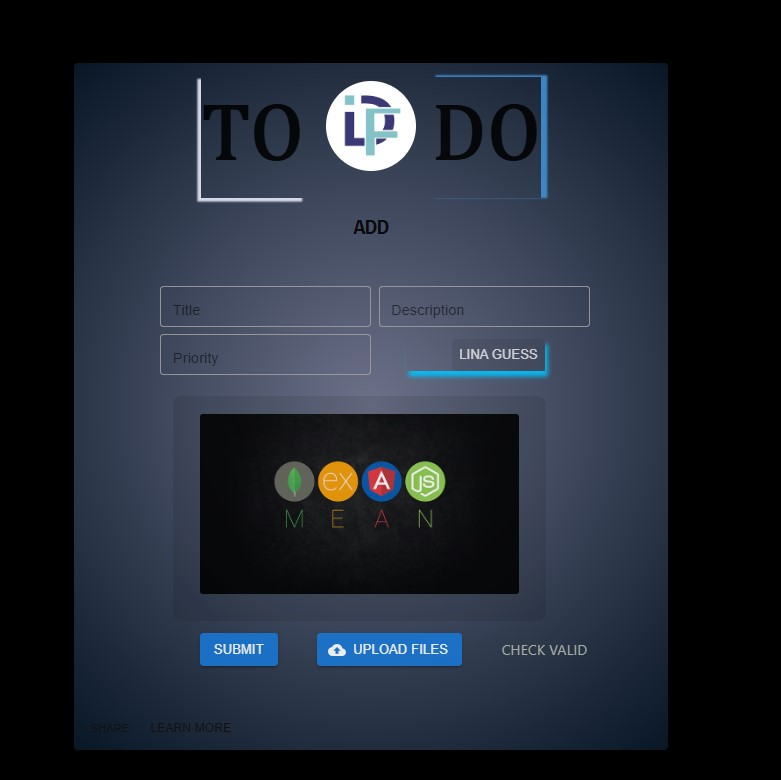

# 🚀 Modern React App with Vite, Redux & TypeScript

> **Онлайн-версия:** [https://sergeygetman.github.io/Kanban_DRP/](https://sergeygetman.github.io/Kanban_DRP/)
>
> A modern single-page application (SPA) built with cutting-edge frontend technologies and best practices. This project demonstrates a deep understanding of application architecture, state management, type safety, and automated build processes with high code quality standards.

---

## 🛠️ Tech Stack

- **React** — Component-based UI development
- **TypeScript** — Full static typing for safer, more maintainable code
- **Redux Toolkit** — Efficient global state management with minimal boilerplate
- **Vite** — Blazing-fast dev server and instant hot module replacement (HMR)
- **ESLint** — Code analysis and error prevention
- **Prettier** — Consistent, automated code formatting
- **Husky** — Git hooks to enforce code quality before commits
- **Lint-Staged** — Lint only staged files
- **Path Aliases** (`@/*`) — Clean imports without `../../../` hell

---

## 🌟 Key Features

✅ **Blazing-Fast Development**  
Powered by Vite, the dev server starts instantly, and HMR updates components without reloading the page.

✅ **Scalable Feature-Sliced Architecture**  
The project follows a clean, modular structure for long-term maintainability:
